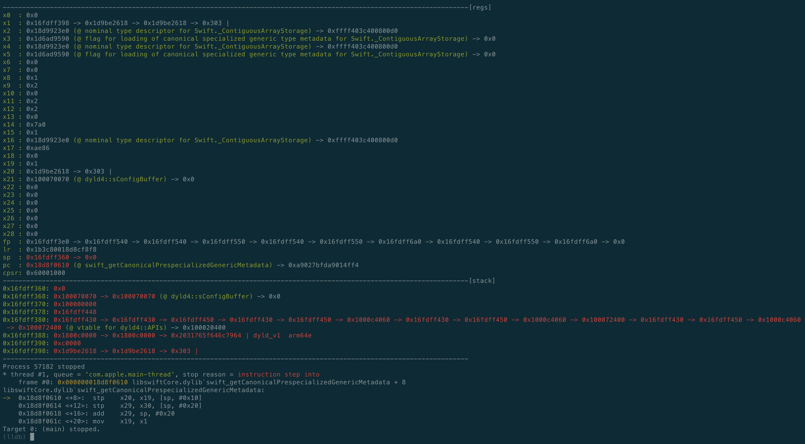

# LLEF: "GDB Enhanced Features"-like, but for LLDB
This script aims to make the use of LLDB easier and much more convenient. Like e.g. [`gdb-gef`](https://github.com/hugsy/gef), this script shows the register contents and the stack whenever execution stops. 
Currently, only Aarch64 is supported, but other architectures will follow.



## Install
Add the following line to `.lldbinit` in your home directory:
```
command script import PATH_TO_CLONED_REPO/gef.py
```
Be sure to use an absolute instead of a relative path.